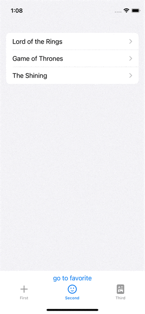
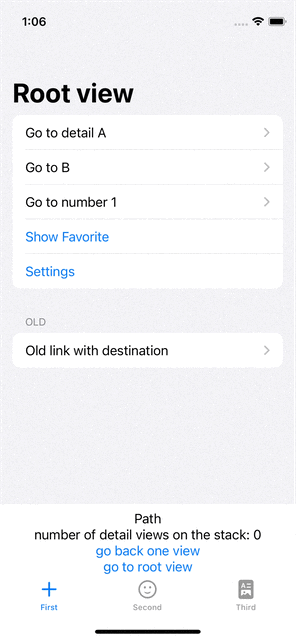
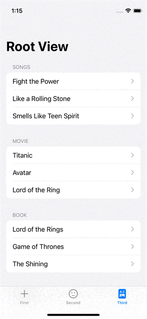

# NavigationStackProject
expamples for the new NavigationStack in SwiftUI

## Main Project
The project uses a TabView for the main navigation. Each tab consists of a separate NavigationStack.

## NavigationStack adds more detail views
You can see the navigation stack data building up when navigation deeper.

## Complex navigation

Go to detail view and select settings button, navigates to settings view.
Example for programmatic navigation

    
## Type erasing NavigationPath

      
## Programmatic Navigation to pop to root view

